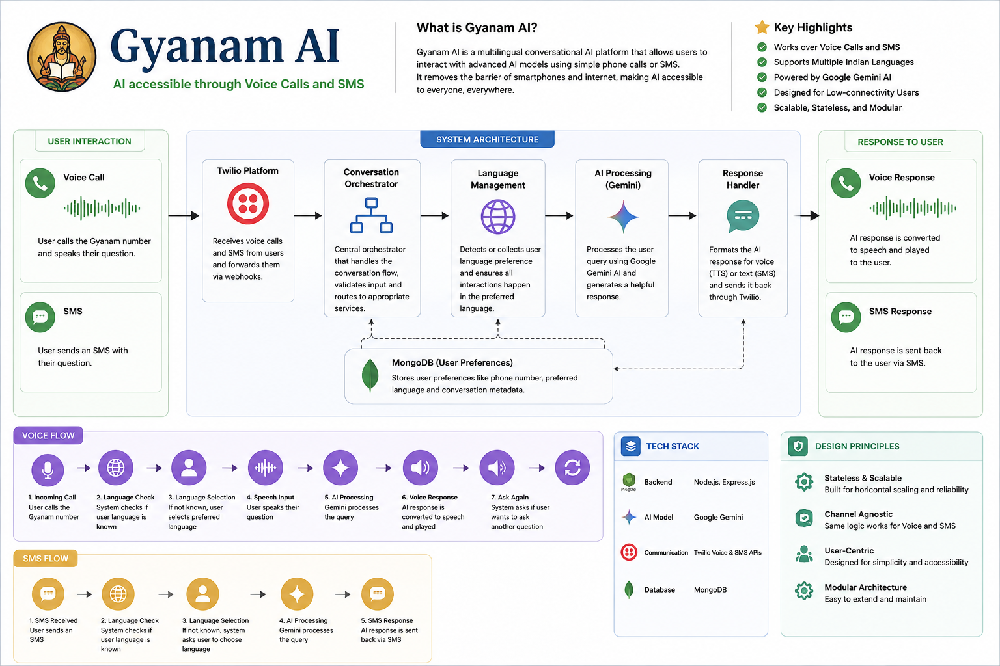
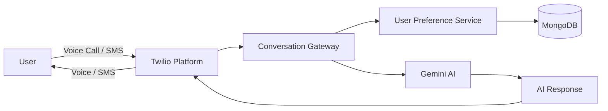

# Gyanam AI

  

> **Democratizing AI through Voice Calls and SMS.**

Gyanam AI is a multilingual conversational platform that enables users to access Large Language Models using ordinary phone calls and SMS. Instead of relying on smartphones or internet connectivity, the platform allows users to interact with AI in their preferred language through familiar communication channels.

---

## Architecture

---

## System Design

The platform is designed around a **communication-first architecture**, where Voice Calls and SMS act as interchangeable communication channels while the AI layer remains completely independent.

- **Conversation Gateway** orchestrates the entire interaction lifecycle.
- **User Preference Service** persists language preferences for personalized multilingual conversations.
- **Gemini AI** is responsible only for inference, independent of how requests arrive.
- **Twilio** abstracts telephony and messaging, enabling the same business logic to serve both Voice and SMS users.
- **MongoDB** stores persistent user preferences while keeping the conversation layer stateless.

---

## Key Capabilities

- AI conversations through Voice Calls and SMS
- Persistent multilingual user preferences
- Unified conversational workflow across communication channels
- Stateless webhook-driven architecture
- Modular AI integration

---

## Technology Stack

| Domain        | Technology              |
| ------------- | ----------------------- |
| Backend       | Node.js, Express.js     |
| AI            | Google Gemini           |
| Communication | Twilio Voice & SMS APIs |
| Database      | MongoDB                 |
